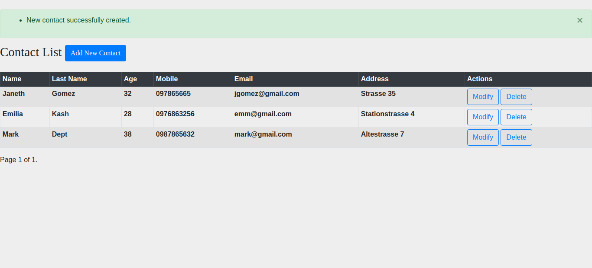
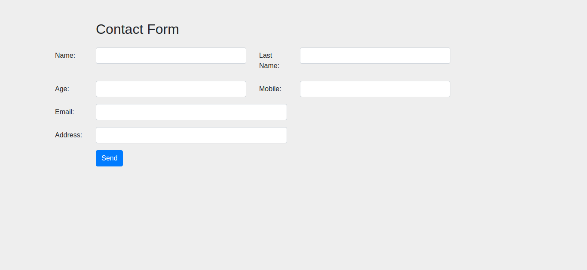
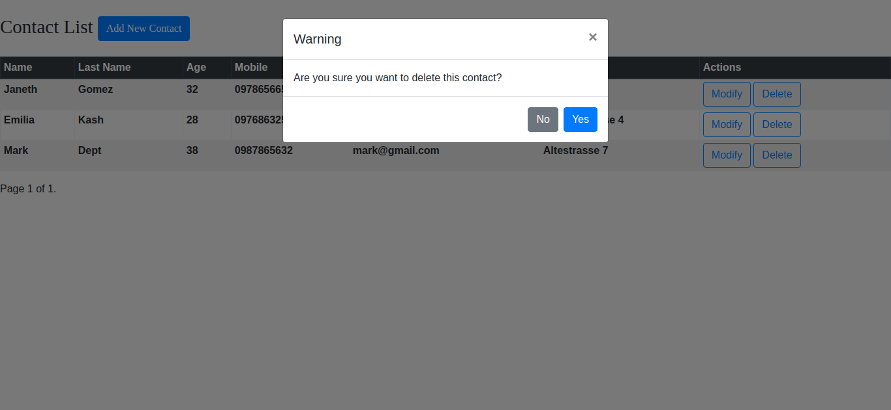

 # Django CRUD App
 
 This is a small project to demostrate Django CRUD functionality.
 
 It consist of a contact list App, with pagination, warning modal message when deleting a contact and a form to create and update a new contact with notification messages depending on the action.
 
 ## The App was built with: 
 Django, Python3, HTML, CSS, SQLITE, Bootstrap  
 
 
 
 
 
 
 
 
